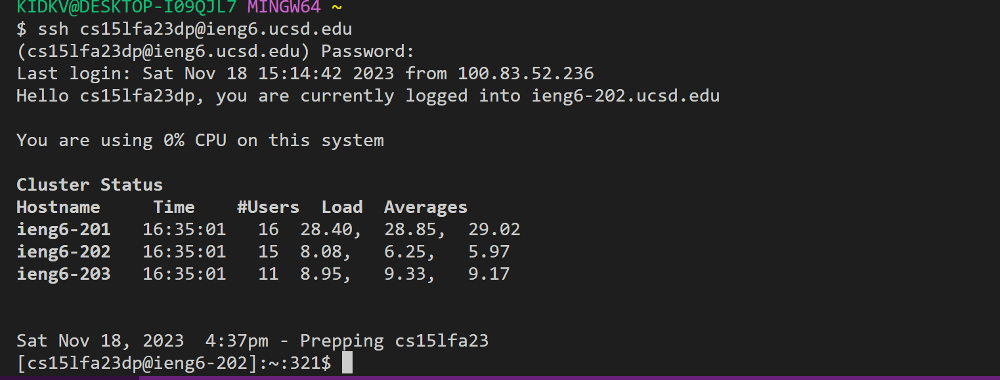
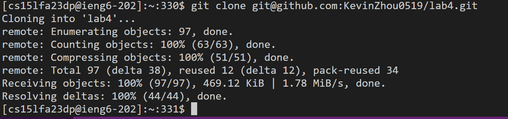
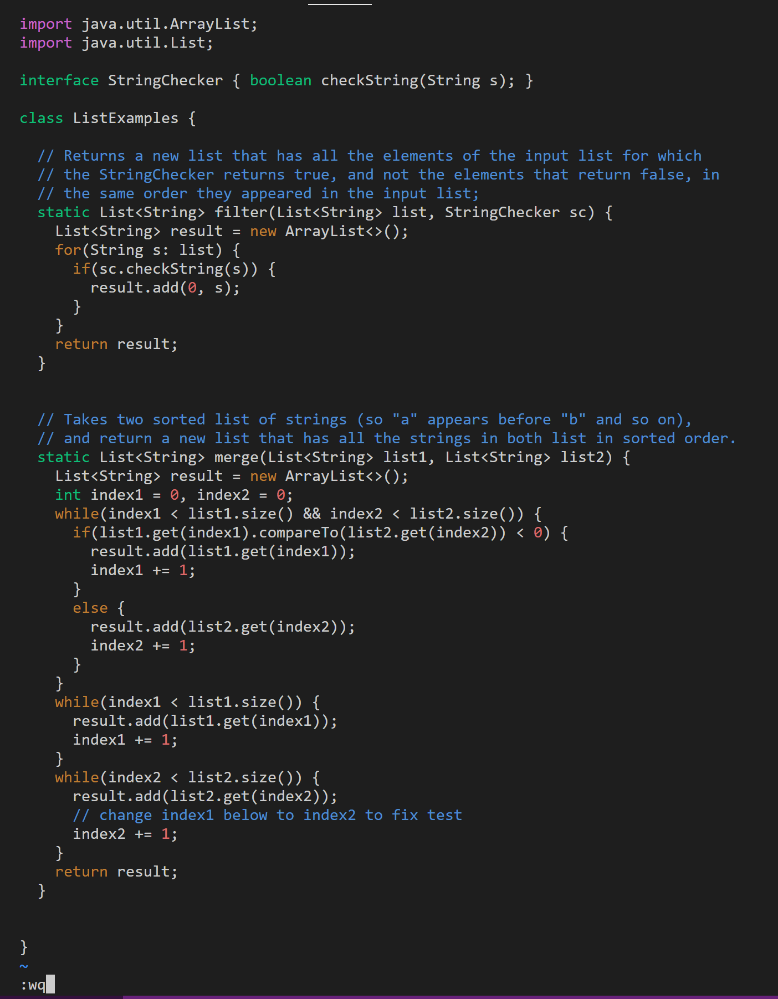
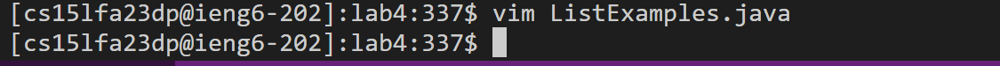
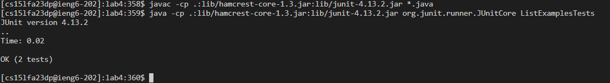

# Step 4
Key pressed: ssh<*space*>cs15lfa23dp<*shift*>2ieng6.ucsd.edu<*Enter*> *password* <*Enter*>
>using ssh to log into school remote account and enter password.

# Step 5
Key pressed: git<*space*>clone<*space*>git<*shift*>2github.com<*shift*>;KevinZhou0519/lab4.git<*Enter*>
>using git clone to download the code from github. Type the link "git@github.com:KevinZhou0519/lab4.git" from the SSN in lab4.

# Step 6
Key pressed: cd<*space*>lab4<*Enter*><*control*>p<*Enter*><*control*>p<*space*><*shift*>list<*shift*>examples<*Enter*>
>using cd to get into lab4 dictionary and copy the J-unit javac and java test code from Week 4 course website " javac -cp .:lib/hamcrest-core-1.3.jar:lib/junit-4.13.2.jar *.java","java -cp .:lib/hamcrest-core-1.3.jar:lib/junit-4.13.2.jar org.junit.runner.JUnitCore". Finally run enter the "ListExmaplesTests" to test this file specifically

# Step 7
Key pressed: vim<*space*><*shift*>list<*shift*>examples.java<*Enter*>/index1<*Enter*>nnnnnnnnnlllllxi2<ESC><shift>;wq
>Using vim to access "ListExmaples.java". Then in vim use /*keyword* to search for "index1". Use n to find the last "index1" and access "1" in "index1" by entering the keyboard word "l". Then use "x" to delete the "1" and press "i" to get into insert mode at the position after "x" in "index". Add 2 to the end of "index" and press "ESC" in the keyboard to get back to the normal mode. Finally enter :wq to save the changes.

# Step 8
Key pressed: <*up*><*up*><*up*><*up*><*Enter*><*up*><*up*><*up*><*up*><*Enter*>
>Using <*up*> four times to get the "javac -cp .:lib/hamcrest-core-1.3.jar:lib/junit-4.13.2.jar *.java" because this command is in the fourth search history. <*Enter*> to compile all of the java files. Then use <*up*> four times again to get "java -cp .:lib/hamcrest-core-1.3.jar:lib/junit-4.13.2.jar org.junit.runner.JUnitCore ListExamplesTests" because this command is also in the fourth search history. Run the "ListExmaplesTests" to check the J-unit test.

# Step 9
Key pressed: 
1. git<*space*>add<*space*><*shift*>list<*shift*>examples.java<*Enter*>
3. git<*space*>commit<*Enter*>changed<*ESC*><*shift*>;wq
4. git<*space*>push
>Using "git add" to add the "ListExamples.java" to github. Then use "git commit" to commit the changes in git hub with the message "changed". Finally use "git push" to push it into the git hub to make final changes

