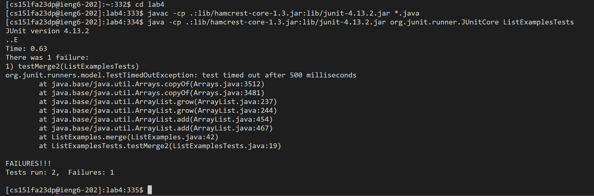

# Step 4
Key pressed: ssh<*space*>cs15lfa23dp<*shift*>2ieng6.ucsd.edu<*Enter*> *password* <*Enter*>
>using ssh to log into school remote account and enter password.

# Step 5
Key pressed: git<*space*>clone<*space*>git<*shift*>2github.com<*shift*>;KevinZhou0519/lab4.git<*Enter*>
>using git clone to download the code from github. Type the link "git@github.com:KevinZhou0519/lab4.git" from the SSN in lab4.

# Step 6
Key pressed: cd<*space*>lab4<*Enter*><*control*>p<*Enter*><*control*>p<*space*>ListExamplesTests<*Enter*>
>using cd to get into lab4 dictionary and copy the J-unit javac and java test code from Week 4 course website " javac -cp .:lib/hamcrest-core-1.3.jar:lib/junit-4.13.2.jar *.java","java -cp .:lib/hamcrest-core-1.3.jar:lib/junit-4.13.2.jar org.junit.runner.JUnitCore". Finally run enter the "ListExmaplesTests" to test this file specifically

# Step 7
Key pressed: vim<*space*><*shift*>list<*shift*>examples.java<*Enter*>/index1<*Enter*>nnnnnnnnnlllllxi2<ESC><shift>;wq
>Using vim to access "ListExmaples.java". Then in vim use /*keyword* to search for "index1". Use n to find the last "index1" and access "1" in "index1" by entering the keyboard word "l". Then use "x" to delete the "1" and press "i" to get into insert mode at the position after "x" in "index". Add 2 to the end of "index" and press "ESC" in the keyboard to get back to the normal mode. Finally enter :wq to save the changes.
.png)

